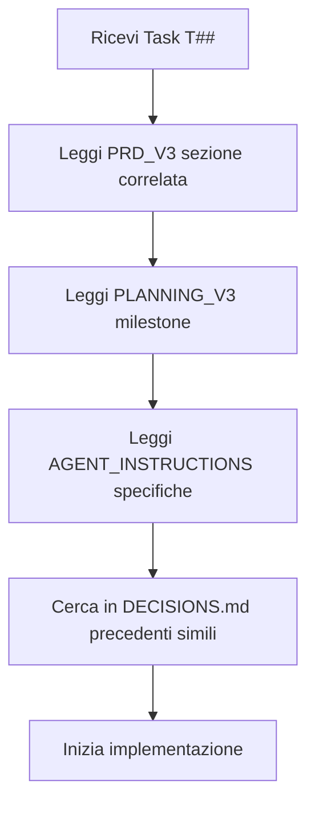
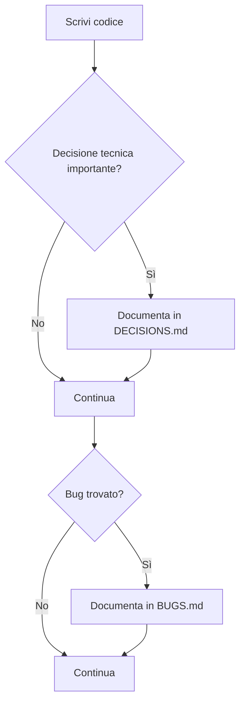
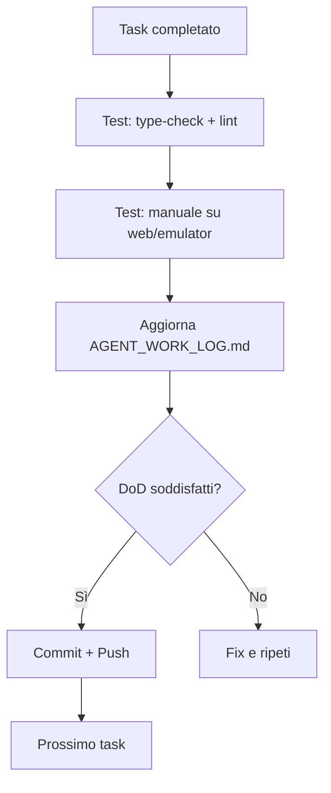

# 📚 Project Knowledge - Post-Man

**Cartella**: `pk/` (Project Knowledge)
**Scopo**: Centralizzare TUTTA la conoscenza del progetto in file strutturati

---

## 📖 Indice File (Ordine di Lettura Raccomandato)

### 1️⃣ Per Iniziare

| File | Scopo | Per Chi | Priorità |
|------|-------|---------|----------|
| **PRD_V3_COMPLETO.md** | Cosa costruire (requisiti v3: KML unico, gating, marker GPS-driven) | Tutti | 🔴 MUST READ |
| **PLANNING_V3_DETTAGLIATO.md** | Quando costruirlo (timeline 4 sett, M1-M5) | Tutti | 🔴 MUST READ |
| **AGENT_INSTRUCTIONS.md** | Come costruirlo (regole agenti AI) | Agenti AI | 🔴 MUST READ |

### 2️⃣ Durante Sviluppo

| File | Scopo | Quando Usarlo |
|------|-------|---------------|
| **AGENT_WORK_LOG.md** | Log lavoro svolto | ✅ Dopo OGNI task completato |
| **DECISIONS.md** | Decisioni tecniche | 🎯 Quando scegli implementazione |
| **BUGS.md** | Bug tracker | 🐛 Quando trovi/fixi bug |
| **TODO.md** | Task futuri | 📋 Quando identifichi lavoro nuovo |

### 3️⃣ Testing & Utenti

| File | Scopo | Per Chi |
|------|-------|---------|
| **../TESTING_WORKFLOW.md** | Come testare (desktop/mobile) | Developer, Tester |
| **../MANUALE_UTENTE.md** | Guida utente non-tecnico | Utenti finali, QA |

### 4️⃣ Documenti Originali (Legacy)

| File | Status | Note |
|------|--------|------|
| PRD Nuovo.txt | 📦 Deleted | Sostituito da PRD_V3_COMPLETO.md |
| planning.txt | 📦 Deleted | Sostituito da PLANNING_V3_DETTAGLIATO.md |
| PRD_V2, PLANNING_V2 | 📦 Deleted | Sostituiti da V3 (breaking changes) |

---

## 🚀 Quick Start per Nuovi Agenti/Developer

### Step 1: Lettura Obbligatoria (1-2h)

```bash
# Leggi in QUESTO ordine:
1. PRD_V3_COMPLETO.md           # 30 min
2. PLANNING_V3_DETTAGLIATO.md   # 20 min
3. AGENT_INSTRUCTIONS.md        # 30 min
4. TESTING_WORKFLOW.md          # 15 min
```

### Step 2: Setup Ambiente (30 min)

```bash
# Segui MANUALE_UTENTE.md o TESTING_WORKFLOW.md
cd Post-Man-clean
npm install
npm run type-check
node scripts/test-app.js
npm run web  # Test rapido
```

### Step 3: Primo Task (varia)

```bash
# 1. Scegli task da PLANNING_V3_DETTAGLIATO.md (es. T09, T10)
# 2. Leggi specifiche dettagliate nel file
# 3. Implementa seguendo AGENT_INSTRUCTIONS.md
# 4. Testa con TESTING_WORKFLOW.md
# 5. Documenta in AGENT_WORK_LOG.md
# 6. Se decisioni tecniche → DECISIONS.md
# 7. Se bug → BUGS.md
```

---

## 📊 Struttura Documentazione

```
Post-Man-clean/
├── pk/                          # 👈 SEI QUI
│   ├── README_PROJECT_KNOWLEDGE.md   # Questo file
│   │
│   ├── 📘 CORE DOCUMENTS (v2 - Completi)
│   ├── PRD_V3_COMPLETO.md           # 1000+ linee - Requisiti v3
│   ├── PLANNING_V3_DETTAGLIATO.md   # 500+ linee - Timeline 4 sett
│   ├── AGENT_INSTRUCTIONS.md        # 788 linee - Regole sviluppo
│   │
│   ├── 📝 TRACKING FILES (Living Docs)
│   ├── AGENT_WORK_LOG.md            # Log lavoro agenti
│   ├── DECISIONS.md                 # Decisioni tecniche
│   ├── BUGS.md                      # Bug tracker
│   ├── TODO.md                      # Backlog task
│   │
│   └── 📦 LEGACY (Archive - v1 txt)
│       ├── PRD Nuovo.txt
│       ├── planning.txt
│       └── tasks.txt
│
├── 📱 USER DOCS (Root level per visibilità)
├── TESTING_WORKFLOW.md         # 400+ linee - Guida testing
├── MANUALE_UTENTE.md            # 600+ linee - Guida utente
└── README.md                    # Overview progetto
```

---

## 🎯 Workflow di Lavoro Completo

### Prima di Iniziare un Task



### Durante Implementazione



### Dopo Completamento Task



---

## 📏 Standard di Qualità

### Code Quality

```bash
✅ BEFORE every commit:
npm run type-check  # 0 errori
npm run lint        # 0 errori
npm test            # Tutti test passano (quando disponibili)
```

### Documentation Quality

```markdown
✅ REQUIRED updates dopo ogni task:
- AGENT_WORK_LOG.md: Sempre (cosa fatto, DoD status)
- DECISIONS.md: Se scelta tecnica non-ovvia
- BUGS.md: Se bug trovato o fixato
- TODO.md: Se nuovo lavoro identificato
```

### Commit Message Quality

```bash
✅ FORMATO:
type(scope): description

feat(map): implement T20 polyline renderer with simplification
fix(gps): resolve location permission crash on Android 10
docs(prd): add GPS accuracy specifications
```

---

## 🆘 Cosa Fare Quando...

### ...Non Capisco una Specifica

1. Ri-leggi PRD_V3_COMPLETO.md sezione correlata
2. Cerca in DECISIONS.md se già discusso
3. Controlla AGENT_WORK_LOG.md per precedenti simili
4. Se ancora unclear → documenta domanda in DECISIONS.md e proponi soluzione

### ...Trovo un Bug

1. Verifica se in BUGS.md già esiste
2. Riproduci almeno 2 volte
3. Compila template in BUGS.md completamente
4. Se blocker (P0) → fix immediato
5. Altrimenti → continua task, fix dopo

### ...Devo Scegliere tra Alternative

1. Documenta in DECISIONS.md con template
2. Lista almeno 2-3 alternative
3. Pro/contro per ognuna
4. Scegli basandoti su PRD requirements
5. Implementa e documenta rationale

### ...Ho Finito Milestone

1. Verifica TUTTI i DoD soddisfatti
2. Aggiorna AGENT_WORK_LOG.md con summary
3. Aggiorna TODO.md (check completed, add new)
4. Demo a stakeholder (se possibile)
5. Git tag: `m{X}-complete`

---

## 📊 Metriche Progetto (Aggiornate Live)

### Documentazione

| Metrica | Valore | Target |
|---------|--------|--------|
| Linee documentazione | ~4000 | N/A |
| File .md totali | 13 | N/A |
| Coverage requisiti | 100% | 100% |
| Decision documented | 4 | As needed |
| Bugs tracked | 0 active | <5 active |

### Codice (TBD - Post M0)

| Metrica | Valore | Target |
|---------|--------|--------|
| TypeScript errors | 0 | 0 |
| ESLint errors | 0 | 0 |
| Test coverage | TBD | >70% |
| Performance | TBD | See PRD |

---

## 🔗 Link Utili Rapidi

### Documentazione Tecnica

- **Expo**: https://docs.expo.dev/
- **React Native Maps**: https://github.com/react-native-maps/react-native-maps
- **expo-location**: https://docs.expo.dev/versions/latest/sdk/location/
- **expo-sqlite**: https://docs.expo.dev/versions/latest/sdk/sqlite/
- **TypeScript**: https://www.typescriptlang.org/docs/

### Tools & Libraries

- **Turf.js** (geo utils): https://turfjs.org/
- **Geolib** (distance/bearing): https://www.npmjs.com/package/geolib
- **KML Reference**: https://developers.google.com/kml/documentation/kmlreference

### Project Specific

- **Repository**: [GitHub URL - TBD]
- **Issues**: [GitHub Issues - TBD]
- **CI/CD**: [GitHub Actions - TBD]

---

## 🎓 Best Practices Promemoria

### DO ✅

- **Leggi PRD prima** di ogni task
- **Documenta tutto** in file appropriati
- **Type-check sempre** prima di commit
- **Testa su device reale** features GPS/mappe
- **Chiedi se unclear** (via DECISIONS.md)

### DON'T ❌

- **Non improvvisare** architettura
- **Non skipare testing**
- **Non commitare senza lint**
- **Non dimenticare AGENT_WORK_LOG**
- **Non assumere senza verificare**

---

## 📞 Support & Questions

### Per Domande Tecniche

1. Cerca in docs esistenti (questo folder)
2. Controlla DECISIONS.md per precedenti
3. Proponi soluzione in DECISIONS.md
4. Implementa dopo approval

### Per Bug Report

- Usa template in BUGS.md
- Include logs/screenshot
- Steps to reproduce chiari

### Per Feature Requests

- Documenta in TODO.md sezione "Ideas"
- Prioritizza (P1/P2/P3)
- Linka a relevant PRD section

---

**Versione**: 1.0
**Ultimo Aggiornamento**: 2025-10-04
**Mantenuto da**: Project Team
**Review Cycle**: Dopo ogni milestone

---

## Change Log

| Data | Autore | Modifiche |
|------|--------|-----------|
| 2025-10-04 | Claude Sonnet 4 | Creazione iniziale, setup completo docs v2 |

---

**Nota**: Questo file è l'**indice master** di tutta la conoscenza progetto. Mantienilo aggiornato quando aggiungi/modifichi documenti in `pk/`.
